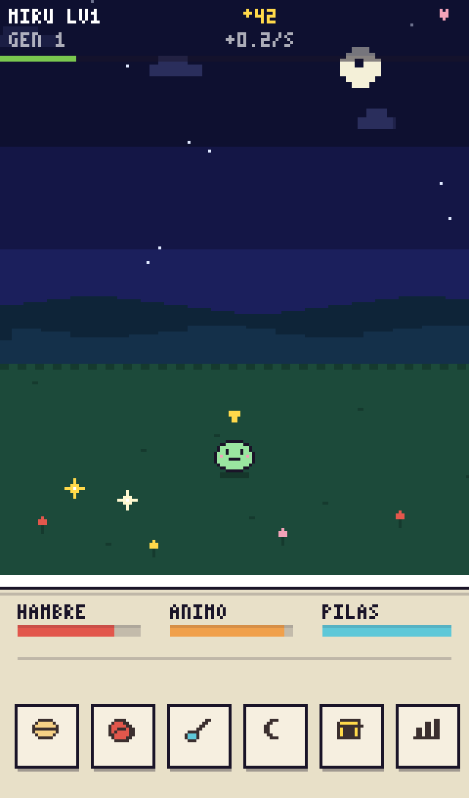
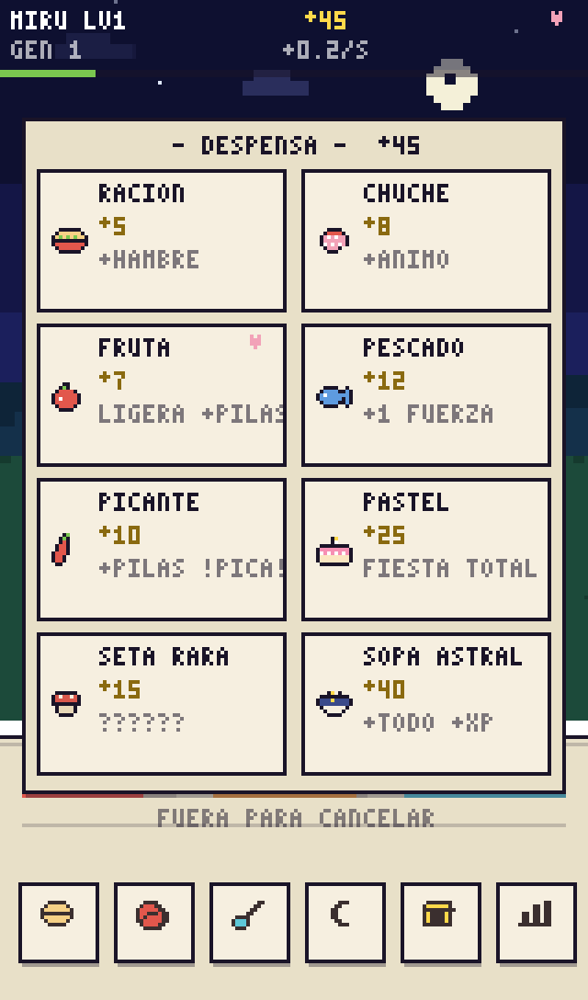
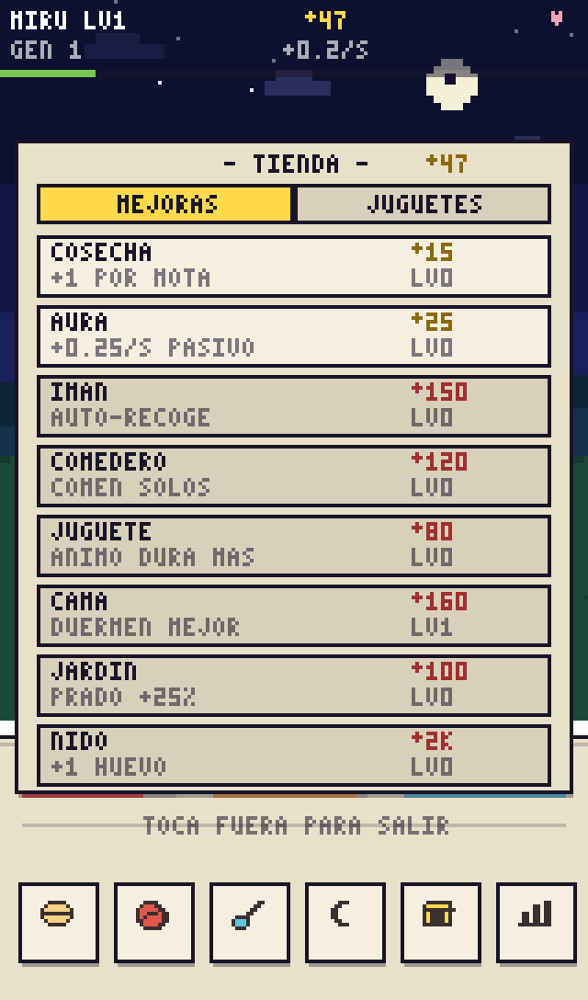
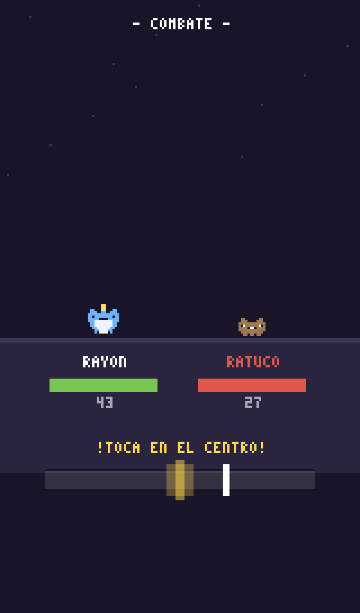

<div align="center">



# 🥚 BITXO

**Mascota virtual + idle incremental en pixel art, directa en tu navegador.**

[](https://gavilanbe.github.io/bitxo/)


</div>

---

## 🐣 Qué es esto

**BITXO** es un cruce entre Tamagotchi y juego idle: cuidas a un bicho de bolsillo
(dale de comer, límpialo, juega con él, apágale la luz), y mientras tanto su prado
produce **motas ✦** con las que compras mejoras, comida, juguetes... Todo culmina
en la **ascensión**: tu adulto sube al cielo como estrella eterna, funda una
dinastía y cada generación siguiente nace más fuerte.

Todo es **100% procedural y cero assets**: los sprites son cadenas de texto que se
pintan píxel a píxel, la música es un secuenciador chiptune sobre Web Audio con
ondas de pulso NES, y hasta los pájaros del amanecer y los grillos de la noche se
sintetizan al vuelo. Ni una imagen, ni un mp3 — solo JavaScript y un `<canvas>`.

## ✨ Qué tiene dentro

- 🧬 **5 líneas** (PRADERA, BRASA, MAREA, PETREA, ASTRO) × 9 formas + 1 forma
  oculta = **46 bitxos** para el álbum. Cómo lo cuides decide en qué evoluciona.
- 🎭 **6 caracteres** (glotón, valiente, dormilón, juguetón, tímido, curioso) que
  cambian de verdad las reglas.
- 🌦️ **Mundo vivo**: día/noche con tu reloj real, lluvia, viento, niebla,
  estrellas fugaces a las que pedir deseos, y una constelación que crece con cada
  ascensión de tu dinastía.
- 🎮 **3 minijuegos** (atrapa-motas, baile rítmico, simón floral) y **entrenamiento**.
- ⚔️ **Combate**: bichos salvajes que vienen a robarte motas y un jefe cada 10
  victorias.
- 🗺️ **Expediciones** de hasta 8 horas que traen motas, XP, **10 reliquias** con
  bonus pasivos y huevos de otras líneas.
- 🏪 **Economía idle completa**: 8 mejoras, 8 comidas (cada línea tiene su
  favorita), 3 juguetes que viven en el prado, 15 logros y regalo diario con racha.
- 😴 **Progreso offline** de hasta 14 h — pero ojo: si lo dejas con hambre
  demasiado tiempo, se irá en busca de comida...
- 🎵 **Banda sonora procedural**: canciones distintas para el día, la noche, la
  lluvia y el combate, con bajo, armonía, batería y swing.

## 🎮 Cómo se juega

Todo con el dedo (o el ratón). Diseñado para móvil en vertical.

| Toque | Acción |
|---|---|
| Botonera inferior | `COMER` · `JUGAR` · `LIMPIAR` · `LUZ` · `TIENDA` · `DATOS` |
| Tocar a tu bitxo | Acariciarlo (+ánimo) · si hay varios, seleccionarlo |
| Tocar el huevo | Acelerar la eclosión |
| Tocar una chispa ✦ | Recoger motas |
| Tocar un bicho salvaje | ¡Combate! Para el golpe: toca cuando el marcador pase por el centro |
| Tocar la estrella fugaz | Pedir un deseo (solo de noche) |
| Esquina superior derecha | Silenciar / activar sonido |

## 📸 Capturas

| El prado | La despensa | La tienda | Combate |
|:--:|:--:|:--:|:--:|
|  |  |  |  |

## 🚀 Ejecutar en local

Sin dependencias, sin build. Solo hace falta servirlo estático:

```bash
make            # sirve en http://localhost:4321 y abre el navegador
# o a mano:
python3 -m http.server 4321
```

## 🧱 Arquitectura

El código vive en `src/`, separado por dominios (`core/`, `data/`, `audio/`,
`game/`, `render/`) y cargado como scripts clásicos en orden de dependencia —
sin bundler, lo que se despliega es lo que hay en el repo. El detalle completo y
las recetas para extender el juego (nueva comida, nueva especie, nuevo minijuego)
están en [ARCHITECTURE.md](ARCHITECTURE.md).

La partida se guarda sola en `localStorage` (clave `bitxo-save`), con migración
automática de partidas de versiones antiguas.

## 📜 Licencia

[MIT](LICENSE) — juega, trastea y haz crecer tu dinastía.
